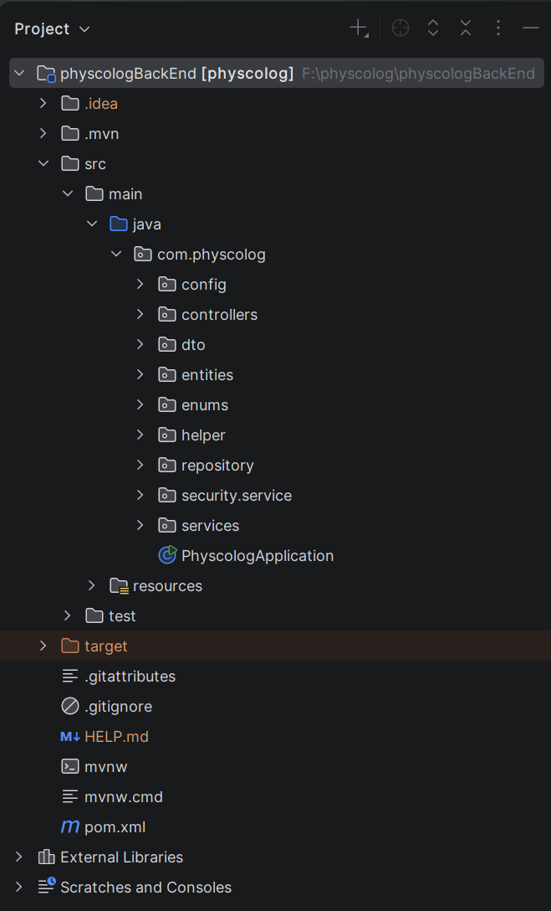

# Physcolog Backend

A production-oriented backend application developed for a professional psychology platform using **Java and Spring Boot**.

The project follows a layered architecture and demonstrates practical enterprise backend development with REST APIs, Spring Security, JWT authentication, JPA/Hibernate, DTOs, repositories, services, validation, and PostgreSQL.

## Project Preview

### Application Architecture



## Authentication

The API is secured using **Spring Security and JWT (JSON Web Token)** authentication.

The authentication flow is based on:

1. User authentication
2. JWT token generation
3. Token-based request authentication
4. Role-based authorization

Protected endpoints require a valid JWT token in the request header:

```http
Authorization: Bearer <JWT_TOKEN>
```

## Backend Technologies

- Java
- Spring Boot
- Spring Security
- JWT
- JPA / Hibernate
- PostgreSQL
- Maven
- REST API

## Features

- RESTful API architecture
- JWT-based authentication
- Spring Security
- Role-based authorization
- DTO-based API design
- JPA / Hibernate
- PostgreSQL
- Layered architecture
- Service and repository patterns
- Entity / DTO separation
- Request validation
- Global configuration
- Exception handling
- Helper and utility components
- Maven-based project structure

## Architecture

The application follows a layered backend architecture:

```text
src/main/java/com/physcolog
│
├── config
├── controllers
├── dto
├── entities
├── enums
├── helper
├── repository
├── security.service
├── services
│
└── PhyscologApplication
```
